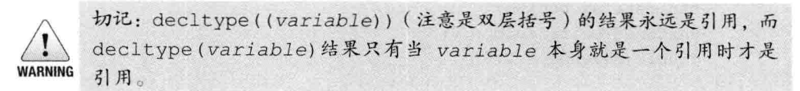

<h1> C++ Primer 5th阅读笔记</h1>  

说明：仅仅保留**某一段时间** ，**本作者**认为重要的内容，具备时效性且没有泛用性。
<h2> 第二章 变量与基本类型</h2>

2.1.3 字面值常量


2.2.2 变量声明和定义的关系  
> + 变量声明：规定变量类型和定义  
> + 变量定义：包含声明，还负责初始化和申请存储空间
> + <span style="color:blue">extern</span>：声明一个变量而非定义【不要显式地初始化变量，会变成定义】。


2.3.2 指针
> 1. void指针
>> + void\*是一种特殊的指针类型，可用于存放任意对象的地址。
>> + 功能比其他指针少：与其他指针比较、作为函数的输入或输出，或者赋给另外一个void*指针。
>> + 因为该地址包含的对象未知，所以不能直接操作void*指针所指的对象。

2.3.3 复合类型


> 1. 对指针的引用
```cpp
int i = 42;
int * pi;       //P是一个int型指针
int *&r = pi;     //r是一个对指针p的引用
```

2.4.4 常量表达式和constexpr
> 1. 是指值不会改变且在**编译过程**就能得到结果的表达式。
> 2. 将变量声明为 constexpr类型以使由编译器来验证变量的值是否是一个常量表达式。
> 3. constexpr修饰指针仅对指针本身有效，与指针指向的对象无关。

2.5.1 类型别名


2.5.2 auto说明符
> 1. auto会忽略顶层const（声明称const auto类型重新赋予顶层const属性），会保留底层const
> 2. 用auto定义多个变量时，必须保证变量的基本类型相同。
> 3. auto与decltype(expr/var):
> > + auto变量需要推断类型，所以必须要初始化
> > + decltype使用参数的类型，可以不初始化；能保留顶层const


2.6.3 编写头文件
> 1. 文件保护符
>> + #define指令把一个名字设定为预处理变量；
>> + #ifdef当且仅当变量已定义时为真，#ifndef当且仅当变量未定义时为真；
>> + 一旦检查结果为真，则执行后续操作直至遇到#endif指令为止。
> ```cpp
//example 如果文件未被包含，执行文件内容，否则忽略
#ifndef var
#define var
...         //该文件内容
#endif
> ```
3.2.2 String对象

> 1. string对象和字符字面值及字符串字面值混在一条语句中使用时，必须确保每个加法运算符(+)的两侧的运算对象至少有一个是string
> ```cpp
> string s1 = s +",";    //正确，一个string与字面值常量相加
> string s2 = "hi" + "," //错误，两个运算对象都不是string
> ```

3.4.1 容器迭代器


3.5.1 数组声明


3.5.5 与旧代码的接口

> 1. string对象装换为C风格字符串使用【string对象】.c_str

4.1.1 表达式的基本概念

> 1. 左值与右值
>> + 左值：当一个对象被用作左值时，使用的是对象的身份（在内存中的内容）
>> + 右值：当一个对象被用作右值时，使用的是对象的值（内容）

4.5 自增运算符
> + i++ （i--同理）
>> ```cpp
>> i_type func(i_type &i){
>>      i_type a = i;
>>      i = i+1;
>>      return a;
>>  }
>> ```

> + ++i （--i同理）
>> ```cpp
>> i_type func(i_type &i){
>>   i = i+1;
>>   return i;
>> }
>> ```
> + 自增运算符的优先级高于解引用

4.11.1 类型转换
> 1. 无符号对象的类型转换
>> + 如果一个运算对象是无符号类型、另外一个运算对象是带符号类型，而且其中的无符号类型不小于带符号类型，那么带符号的运算对象转换成无符号的；
>> + 如果是带符号类型大于无符号类型，此时转换的结果依赖于机器。如果无符号类型的所有值都能存在该带符号类型中，则无符号类型的运算对象转换成带符号类型。

4.11.3 显式类型转换
> 1. 避免使用强制类型转换
>> + static_cast,dynamic_cast,const_cast,reinterpret_cast都应当少用。每次书写强制类型转换语句都应当考虑是否能以其他方式实现。

4.12 运算符优先级表

