<h1> C++ Primer 5th阅读笔记</h1>  

说明：仅仅保留**某一段时间** ，**本作者**认为重要的内容，具备时效性且没有泛用性。

2.1.3 字面值常量

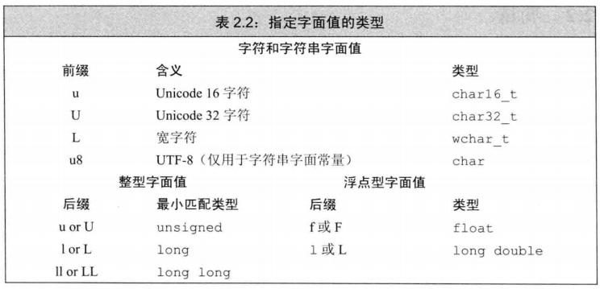

2.2.2 变量声明和定义的关系  
> + 变量声明：规定变量类型和定义  
> + 变量定义：包含声明，还负责初始化和申请存储空间
> + <span style="color:blue">extern</span>：声明一个变量而非定义【不要显式地初始化变量，会变成定义】。

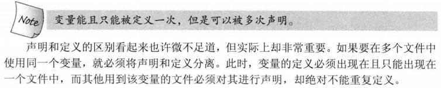

2.3.2 指针
> 1. void指针
>> + void\*是一种特殊的指针类型，可用于存放任意对象的地址。
>> + 功能比其他指针少：与其他指针比较、作为函数的输入或输出，或者赋给另外一个void*指针。
>> + 因为该地址包含的对象未知，所以不能直接操作void*指针所指的对象。

2.3.3 复合类型

> 面对一条比较复杂的指针或引用的声明语句时，从右向左阅读有利于弄清楚它的真实含义。

> 1. 对指针的引用
```cpp
int i = 42;
int * pi;       //P是一个int型指针
int *&r = pi;     //r是一个对指针p的引用
```

2.4.4 <div id="constexpr">常量表达式和constexpr </div>
> 1. 是指值不会改变且在**编译过程**就能得到结果的表达式。
> 2. 将变量声明为 constexpr类型以使由编译器来验证变量的值是否是一个常量表达式。
> 3. constexpr修饰指针仅对指针本身有效，与指针指向的对象无关。

2.5.1 类型别名

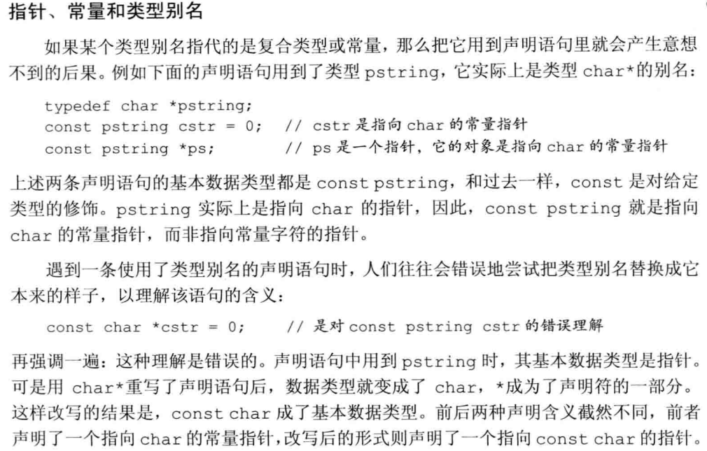

2.5.2 auto说明符
> 1. auto会忽略顶层const（声明称const auto类型重新赋予顶层const属性），会保留底层const
> 2. 用auto定义多个变量时，必须保证变量的基本类型相同。
> 3. <div id="decltype">auto与decltype(expr/var):</div>
> > + auto变量需要推断类型，所以必须要初始化
> > + decltype使用参数的类型，可以不初始化；能保留顶层const
>>>  切记：decltype((variable))的结果永远是引用。而decltype(variable)的结果只有当variable本身是一个引用才是引用。

2.6.3 编写头文件
> 1. 文件保护符
>> + #define指令把一个名字设定为预处理变量；
>> + #ifdef当且仅当变量已定义时为真，#ifndef当且仅当变量未定义时为真；
>> + 一旦检查结果为真，则执行后续操作直至遇到#endif指令为止。
> ```cpp
> //example 如果文件未被包含，执行文件内容，否则忽略
> #ifndef var
> #define var
> ...         //该文件内容
> #endif
> ```

- - -

3.2.2 String对象
> 1. string对象和字符字面值及字符串字面值混在一条语句中使用时，必须确保每个加法运算符(+)的两侧的运算对象至少有一个是string
> ```cpp
> string s1 = s +",";    //正确，一个string与字面值常量相加
> string s2 = "hi" + "," //错误，两个运算对象都不是string
> ```

3.4.1 容器迭代器

> 谨记，但凡是使用了迭代器的循环体，都不要想迭代器素数的容器添加元素。

3.5.1 数组声明

> 想要理解数组声明的含义，最好的办法是从数组的名字开始按照由内向外的顺序阅读

3.5.5 与旧代码的接口

> 1. string对象装换为C风格字符串使用【string对象】.c_str

- - -

4.1.1 表达式的基本概念

> 1. 左值与右值
>> + 左值：当一个对象被用作左值时，使用的是对象的身份（在内存中的内容）
>> + 右值：当一个对象被用作右值时，使用的是对象的值（内容）

4.5 自增运算符
> + i++ （i--同理）
>> ```cpp
>> i_type func(i_type &i){
>>      i_type a = i;
>>      i = i+1;
>>      return a;
>>  }
>> ```

> + ++i （--i同理）
>> ```cpp
>> i_type func(i_type &i){
>>   i = i+1;
>>   return i;
>> }
>> ```
> + 自增运算符的优先级高于解引用

4.11.1 类型转换
> 1. 无符号对象的类型转换
>> + 如果一个运算对象是无符号类型、另外一个运算对象是带符号类型，而且其中的无符号类型不小于带符号类型，那么带符号的运算对象转换成无符号的；
>> + 如果是带符号类型大于无符号类型，此时转换的结果依赖于机器。如果无符号类型的所有值都能存在该带符号类型中，则无符号类型的运算对象转换成带符号类型。

4.11.3 显式类型转换
> 1. 避免使用强制类型转换
>> + static_cast,dynamic_cast,const_cast,reinterpret_cast都应当少用。每次书写强制类型转换语句都应当考虑是否能以其他方式实现。

4.12 运算符优先级表

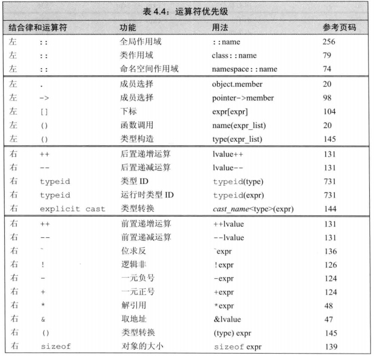

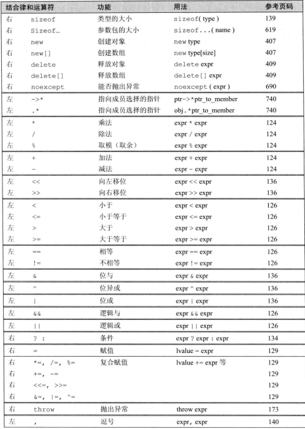

- - -

6.2.3 const形参和实参
> 1. 尽量使用常量引用
>> + 把函数不会改变的参数定义成普通引用，会导致无法接受常量作为参数（比如字面值常量）

6.2.4 数组形参
> 1. 传递多维数组
>> + 因为处理的是数组的数组，所以首元素本身就是一个数组，指针就是一个指向数组的指针。数组第二维（以及后面所有维度）的大小都是数组类型的部分，不能省略。
>> ```cpp
>> //matrix指向数组的首元素，该数组的元素是由10个整数构成的数组
>> void print(int (*matrix)[10],int rowSize){...}
>>``` 

6.2.6 含有可变形参的函数
> 1. initializer_list形参
>> + 用initializer_list<type>()作为形参后，可用"{}"传入数量可变的参数;
>>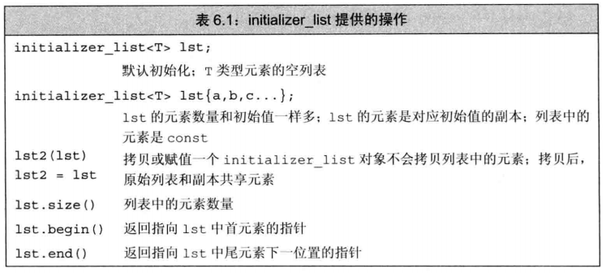
> 2. 省略号形参
>> + 应该仅仅用于C和C++的通用类型
>> + 应注意，大多数类类型对象在传递给省略号形参时都无法正确拷贝

6.3.3 返回数组指针
> 1. 使用尾置返回类型，适用于返回类型比较复杂
>> ```cpp
>> //func接受一个int类型的实参，返回一个指针，该指针指向含有10个整数的数组
>> auto func(int i) -> int(*)[10];
>>```
> 2. 使用[decltype(与返回类型类型相同的参数)](#decltype)作为返回类型

6.4 函数重载
> 1. 重载与const形参
>> + 顶层const不影响传入函数的对象。一个拥有顶层const的形参无法和另一个没有顶层const的形参区分开来;
>> + 如果形参是某种类型的指针或引用，则通过区分其指向的是常量对象还是非常量对象可以实现函数重载，此时的const是底层的;

6.5.2 [constexpr](#constexpr)函数
> 1. 基本性质
>> + constexpr函数被隐式指定为内联函数；
>> + 返回类型和所有形参都是字面值类型；
>> + 函数体中有且仅有一条return语句，其他语句只能包含不在**运行时**执行动作的语句；
>> ```cpp
>> //示例constexpr函数
>> constexpr int substract(const int a,const int b)
>> {
>>     return a-b;
>> }
>> ```
> 2. 如果constexpr函数用于常量表达式
>> ```cpp
>> //使用常量表达式调用此函数就会返回常量表达式
>> constexpr int res = substract(9,5);//res = 4
>> ```
> 3. constexpr函数用于非常量表达式
>> ```cpp
>> //使用非常量表达式调用此类函数，返回非常量表达式
>> int a=9,b=5;
>> int res = substract(a,b);//res = 4
>> constexpr int res = substract(a,b);//编译报错，返回值是非常量表达式
>> ```

6.5.3 调试帮助
> 1. assert(expr)
>> 对expr求值，如果表达式为假(即0，仅为假时有动作), assert输出信息并终止程序的执行。
> 2. NEDBUG
>> + 如果定义了NEDBUG，则assert什么也不做
>> + 预处理器定义的有利于调试的名字

>>> \__func__ 存放函数的名字

>>> \__FILE__ 存放文件名的字符串字面值

>>> \__TIME__ 存放文件编译时间的字符串字面值

>>> \__DATE__ 存放文件编译日期的字符串字面值

6.7 函数指针
> 1. 调用函数指针
>> ```cpp
>>void func(int param);
>> void (*pf)(int param);
>> // 下列两种赋值方式等价
>> pf = param;
>> pf = &param;
>> // 下列三种调用方式等价
>> pf(param);
>> (*pf)(param);
>> func(param);
>> ```
> 2. 函数指针形参
>> ```cpp
>> //下列两种声明函数指针形参方式等价
>> void pfpFunction(void pf(int param));
>> void pfpFunction(void (*pf)(int param));
>> //直接使用函数作为形参自动转换为指针
>> pfpFunction(func);
>>```
> 3. 返回函数指针
>> ```cpp
>> //使用类型别名
>>using F = int(int*,int*);//F是函数类型
>>using FP = int(*)(int*,int*);//FP是函数指针
>>//同样可用使用auto尾置和decltype的方法(注：decltype()返回的是函数类型)
>>``` 
- - - 

7.1.1 设计类
> 1. 常量对象、常量对象的引用或指针都只能调用常量成员函数。

7.1.4 构造函数
> 1. =default
>> 如果既需要自定义构造函数又需要默认构造函数，可以在一个构造函数声明后加上=default

7.2.1 友元
> 1. 友元声明只能在class的内部，但是不受它的区域访问控制级别的约束；
> 2. 当使用在类中声明过的友元函数时，友元函数在类外被声明过是必需的（可能某些编译器会隐式完成）；

7.3.1 类的其他特性
> 1. mutable能将声明类中某些数据成员的可变，即使类是const也是可以修改这些成员

7.4.1 名字查找与类的定义域
> 1. 编译器处理完类中的全部声明后才会处理成员函数定义；
> 2. 一般来说，内层作用域可以重新定义外层作用域中的名字，即使该名字已经在内层作用域中使用过。在类中，如果成员使用了外层作用域中的某个名字，而该名字代表一种类型，则类不能在之后重新定义该名字：
> 3. 不要隐藏外层作用域中可能被用到的名字。如果一定要这样使用，可以通过作用域运算符(::)访问外层被隐藏的变量；
> 4. 无论什么时候都应该牢记：**定义中只能使用已经被声明过的对象**。

7.5.1 构造函数列表初始化
> 1. 如果成员是 const、引用，或者属于某种未提供默认构造函数的类类型，我们必须通过构造函数初始值列表为这些成员提供初值；**建议使用构造函数初始值**；
> 2. 类成员的初始化顺序总是与它们在类定义出现顺序一致，所以建议在构造函数列表初始化成员时与定义中的顺序保持一致，尽量避免用成员去初始化另一个成员；

7.5.2 委托构造函数
> ```cpp
> //非委托构造函数(被委托)
> constructFunc(MemType1 p1,MemType2 p2):mem1(p1),mem2(p2){}
> //委托构造函数
> constructFunc():constructFunc(defaultValue1,defaultValue2){}
> ```
7.5.3 默认构造函数调用
> 如果想定义一个使用默认构造函数进行初始化的对象，正确的方法是去掉对象名之后的空括号对
>```cpp
>classT obj(); //false
>classT obj; //true
>```
7.5.4 隐式的类类型转换
> 1. 只允许一步的（隐式）类类型转换；
>> 1. 定义class sale，假设函数func是接受sale参数，且sale可以用string进行类型转换；
>> 2. 那么形如string s;func(s)的一步类型转换是合法的；
>> 3. 而func("aaaa")这样的类型转换不合法。
> 2. 当使用explicit声明构造函数时，它将只能以直接初始化（对应于拷贝初始化）的形式使用。编译器不会在自动转换中使用该构造函数。
>> + 加explicit前缀的函数被禁止用于隐式转换，但是直接构造是不会触发explicit的功能

7.6 类的静态成员
> 1. 静态成员声明
>> + 类的静态成员被所有对象共享，同时对象中不包含静态数据成员相关的数据。
>> + 静态成员函数也不与任何对象绑定在一起，它们不包含this指针。
>> + 作为结果，静态成员函数不能声明成const的，而且我们也不能在static函数体内使用this指针。
> 2. 静态成员定义
>> + 静态成员必须在类外定义且只能定义一次；
>> + 在类外初始化，不应该在类内初始化（下有特例）。
>> + 可以提供const整数类型的类内初始值，此时**静态变量必须是字面值常量类型的constexpr**；

> 3. 仅适合静态成员的场景
>> + 静态成员可以是不完全类型（指针成员也可以是）
>> + 静态成员可以作为默认参数

- - -

8.1.2 IO条件状态

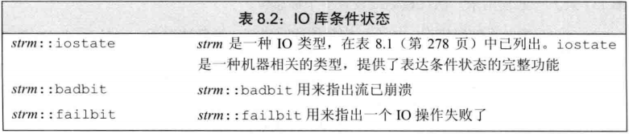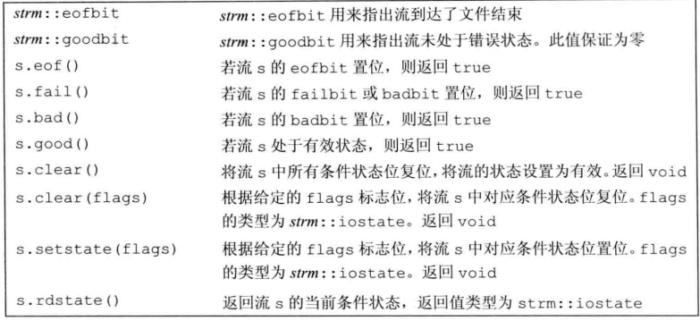

8.1.3管理输出缓存
> 1. 导致缓存刷新的原因
>> 1. 程序正常结束;
>> 2. 缓存区满了;
>> 3. 操纵符显式刷新;
>> 4. 一个流可能关联另一个流。
> 2. 能够刷新缓存区的操作符
>> + flush/endl/ends都能立即刷新当前缓存区一次；
>> + unitbuf能设置每一次输出都刷新缓存区，nounitbuf关闭；
> 3. 程序崩溃时，输出缓存区不会刷新
> 4. 关联输入输出流
>> + 一个输入流被关联到一个输出流时，任何从输入流读取数据的操作都会先刷新关联的输出流；
>> + 通过tie()手动进行流关联
>>> + <iostream>.tie()不带参数返回指向该IO流关联的输出流的指针；
>>> + <iostream>.tie(&os)将这个IO流关联到输出流os上；

8.2.2 文件模式
> 1. 以out模式打开文件会丢弃文件已有数据,而ofstream默认的打开方式是out；
> 2. 保留被ofstream打开的文件中已有数据的唯一方法是显式指定app或in模式；

8.3 string流
> 头文件sstream定义istringstream/ostringstream/stringstream支持**内存**IO，这些类型对string进行与IO流相同的操作

小结
> + iostream处理控制台IO
> + fstream处理命名文件IO
> + stringstream完成内存string的IO

- - -
9.2.4 容器定义和初始化
> 1. 当一个容器直接作为参数初始化另一个容器时，两个容器的容器类型和元素类型都必须相同
> 2. 使用迭代器初始化容器时，不要求容器类型相同；如果两个容器的元素类型能够相互转化，也不要求元素类型相同

9.2.5 容器赋值运算
> 注意：赋值相关运算会导致指向左边容器内部的选代器、引用和指针失效。而swap操作将容器内容交換不会导致失效(容器类型为array【定长数组】和string的情况除外)
> 1. 使用assign（仅顺序容器有效）
>> + seq.assign(il) 将seq中的元素替换为初始化列表il中的元素
>> + seq.assign(n,t) 将seq中的元素替换为n个值为t的元素
> 2. 使用swap
>> + 能交换两个类型相同容器中的内容。本质是数据结构的交换（除了array），比直接赋值更快，也不会导致容器内部的选代器、引用和指针失效（除了array/string）

9.3.1 向顺序容器添加元素
> 2. push/insert是拷贝元素，emplace是将参数传递给元素类型匹配的构造函数

9.3.6 容器操作可能导致迭代器失效
> 1. 添加元素
>> + 如果容器是vector/string且存储空间重新分配，指向容器的迭代器/指针/引用都会失效；若存储空间未重新分配，仅指向**插入位置后**元素的迭代器/指针/引用会失效
>> + 对于deque，插入到除首尾位置的任何位置都会导致迭代器/指针/引用失效；如果是首尾位置，仅**迭代器**失效
> 2. 删除元素
>> + 对于deque，删除除首尾位置的任何位置，指向其他元素的迭代器/引用/指针也会失效；如果删除尾元素，则尾后迭代器会失效
>> + 对于string/vector，指向被删元素之前的元素的迭代器/引用/指针仍有效。
>>当我们删除元素时，尾后迭代器总会失效。
> 3. end迭代器
>> + 如果在一个循环中插入/删除deque、string或vector中的元素，不要缓存end返回的选代器；应该再调用end()函数获取end迭代器。

9.4 vector大小增长
> 1. 能够增大容器内存空间的操作:reserve()，增加元素操作【当所需空间大于capacity()时】
> 2. 能够减小容器内存空间的操作:shrink_to_fit【将capacity()减小到与size()相同，不保证减小内存空间】（其他**减小元素数量**的操作并不能减少容器内存空间）

9.5.3 string搜索操作
> 1. 搜索失败返回string::npos;

9.5.5 string的数值互转
> 1. to_string(),一组重载函数，任意算术类型转string
> 2. sto<v>(),v为任意算数类型，string可以转成该类型

9.6 容器适配器
> 1. 本质是一种机制，可使一种容器类型能够表现得像另一种类型；stack/queue/heap都是适配器

- - -
10.1.1  概述
> 1. 迭代器令算法不依赖于容器，但依赖于元素类型的操作
> 2. 算法本身永远不会直接改变底层容器的大小（迭代器会）

10.2.1 只读算法
> 1. 求累加和
>>```cpp
>> elemType accumulate(vec::iterator iter1,vec::iterator iter2,elemType initValue);
>> //initvalue的类型决定了使用哪个加法运算符和返回类型
>> ```
> 2. 两个序列是否相等
>>```cpp
>>bool equal(vec1::cbegin(),vec1::cend(),vec2::cbegin());
>>```
>>重要假设：所有只接受单一迭代器表示第二个序列的算法，都假定第二个序列至少和第一个序列一样长。

10.2.2 写容器的算法
> 1. 算法本身不检查写操作
>> 向目的位置迭代器写入数据的算法假定目标位置足够大，能够容纳要写入的元素
> 2. back_inserter()
>> 接受一个容器引用，返回一个插入迭代器；使用该迭代器进行赋值时，会自动调用push_back讲一个具定值的元素添加到容器中

10.2.3 重排容器元素算法
> 1. unique()
>> 功能是重排输入范围并将重复元素分离出来。接受两个迭代器表示输入范围，返回迭代器指向不重复区域的end()（即被分离的重复元素的范围中的第一个元素）。
>> 删除重复需要用vec.erase()删除重复元素的区域的所有元素。
> 2. sort()和stable_sort()   --排序和稳定排序

10.3.1 传递函数给算法
> + 谓词是一个可调用的表达式，其返回结果是个能用做条件的值；
> + 标准库算法接受的谓词分为两类：一元谓词和二元谓词；
> + 接受谓词参数的算法对输入序列的元素调用谓词；

10.3.2 lambda函数
> 完整形式：\[capture list](*parameter list) *->return_type {function body} -\*号可省略
>> 被捕获列表在lambda函数当前所在函数捕获的局部非static变量才能在lambda函数体使用。lambda可以直接使用局部static变量和在它所处函数之外声明的名字
>> 不能有默认参数

> find_if()和find_each()
>> 都接受一对表示范围的迭代器和一个对该范围调用的谓词；
>> find_if()对返回范围内第一个使谓词返回非0值元素；find_each()对范围内每一个元素都执行一次谓词

10.3.3 lambda捕获和返回
> 1. 显式捕获
>> + 值捕获，被捕获变量的值在lambda创建时捕获而不是调用时；
>> + 引用捕获，必须保证引用对象存在；
> 2. 隐式捕获，可以捕获所在函数的所有对象
>> + \[&]全部作为引用捕获,\[=]全部作为值捕获。
>> + 可以显式隐式混合捕获。
> 3. 返回的特性
>> + 默认情况下，lambda体包含return之外的任何语句，编译器都假定它返回void，所以需要指定返回类型；
>> + 只包含return语句时则能进行类型推断;
> 4. transform() 
>> + 接受表示输入序列的两个迭代器、目标位置起始的一个迭代器和一个谓词
>> + 把输入序列经过谓词处理后，写到目标位置

10.3.4 参数绑定
> 1. 作为谓词的普通函数不能捕获局部变量，而谓词一元或二元会限制函数的参数数量。此时普通函数想要额外使用局部变量可使用参数绑定bind()
>> + 一般形式：auto newCallable = bind(callable,arg_list)
>> + 调用newCallable == 调用传入arg_list的callable
>> + arg_list中包含形如"_n"的占位符，表示newCallable的参数。\_n表示newCallable应当接受的第n个参数(n=1,2,3...)。占位符的名字都定义在std::placeholders中。
>> + 如果需要传递给bind()一个参数而又不拷贝它，就必须使用ref()函数。ref返回给定对象的reference_wrapper<T>类类型，用来模仿一个类型T对象的引用。

10.4 迭代器
> 1. 插入迭代器(只有当前容器支持该插入操作的前提下才能使用)
>> + back_inserter创建一个使用push_back的迭代器
>> + front_inserter创建一个使用push_front的迭代器
>> + inserter创建一个使用insert的迭代器。接受迭代器作为第二个参数，元素将被插入到给定迭代器所表示的元素之前。
> 2. stream迭代器
>> + istream_iterator<ty>(is)，读取输入流is，必须指定读写的对象类型ty且该类型必须定义了输入运算符。默认初始化迭代器可当做尾后值使用。
>> + ostream_iterator<ty>(os)，写到输出流os，可以提供第二个参数接受一个c风字符串，在输出每个元素后都会打印该字符串。
>> + 推荐在流迭代器的书写中保留*和++，忽略它们对程序没有任何影响，但是能在形式上与其他迭代器保持一致。
> 3. 反向迭代器
>> + 反向迭代器需要递减运算符，递增递减与常规迭代器方向相反
>> + reverse_iterator.base()可以获得对应正向的iterator
>> + 当从一个普通的迭代器初始化一个反向迭代器，迭代器与原迭代器指向的并不是相同的元素,因为两者反映的都是左闭右开区间。
>>> 举例:[line.crbegin(),rcomma)和[rcomma.base(),line.cend())指向相同的区间。

10.5.1 五类迭代器
>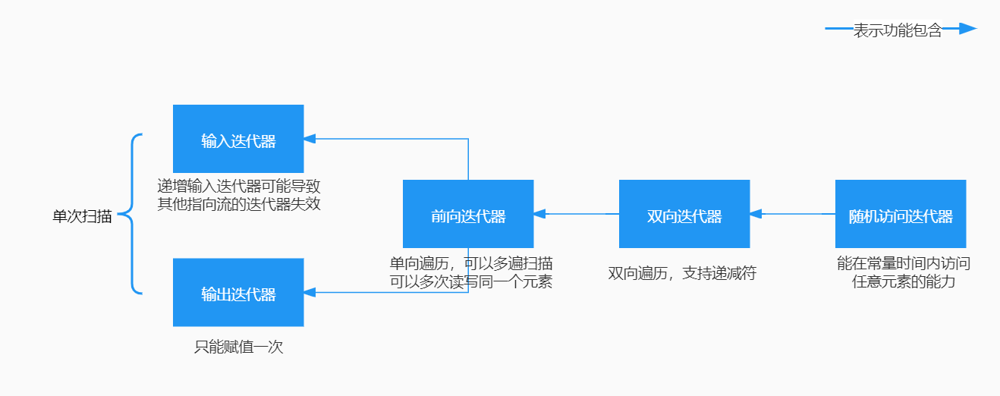

10.5.2 算法形参模式
> 1. 通常模式
>> ```cpp
>> alg(beg,end,other_args);
>> alg(beg,end,dst,other_args);
>> alg(beg,end,beg2,other_args);
>> alg(beg,end,beg2,end2,other_args);
>>```
> 2. 接受单个目标迭代器(dst)的算法
>> 向输出迭代器写入数据的算法都假定目标空间足够容纳写入的数据。
> 3. 接受第二个输入序列的算法
>> 接受单独beg2的算法假定从beg2开始的序列与beg和end所表示的范围至少一样大

10.6 链表容器特定算法
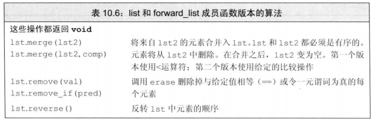
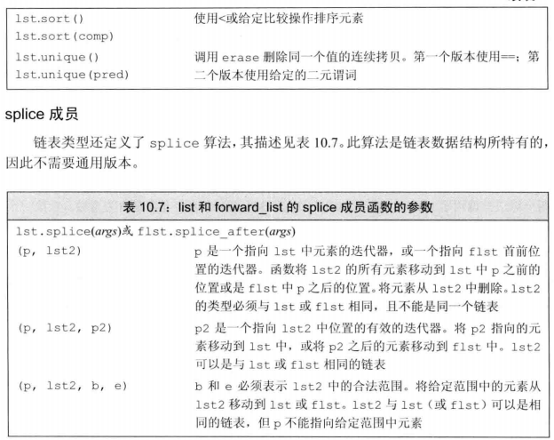
- - -

11.2 关联容器概述
> 1. map接受键值对，set接受关键字，两者键都唯一。multimap和multiset可以接受重复的键值。
> 2. 使用为自定义类型的关联容器必须自定义该类型的比较函数comp()，定义该容器时传入该函数指针multimap<>mapName(comp)
> 3. pair类型，能够同时保存两个不同类型的数据成员

11.3 关联容器操作

> 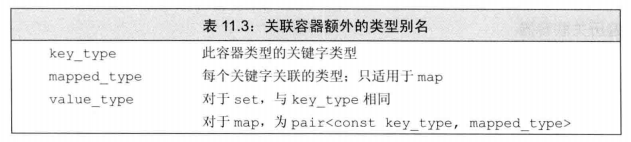
> 1. 迭代器
>> + map的value_type是一个pair，可以改变值但是不能改变关键字；
>> + set的迭代器都是const，可以访问，不能修改；
>> + 遍历关联容器可以通过v.begin()、v.end()两个迭代器;
> 2. 添加元素
>> + v.insert() 接受一个pair类型插入到关联容器中，该函数返回一个pair。
>>> + first成员是一个指向插入关键字的迭代器；
>>> + second成员是bool，如果关键字已存在则插入失败，返回false，不然就是true。
>> + multi关联容器的insert()不用考虑元素重复，一定成功所以仅返回一个迭代器。
> 3. 删除元素
>> + v.erase()
>>> + 接受一个关键字k，删除容器中所有关键字为k的元素，返回size_type指出删除的数量；
>>> + 接受一个迭代器，删除这个迭代器指向的容器元素，返回指向下一个元素的迭代器；
>>> + 接受迭代器b、e，删掉b和e范围中的所有元素，返回e。
> 4. 下标操作
>> map和unordered_map提供了下标操作，下标运算符和对应的at()函数
>>> + m\[k] 返回关键字为k的元素，不存在就添加一个这样的元素并对其进行值初始化
>>> + m.at(k) 访问关键字为k的元素，不存在就扔出out_of_range异常。
> 5. 访问元素
>> 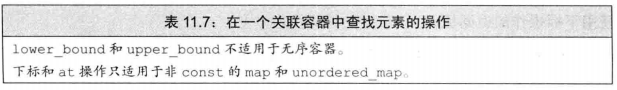
>> 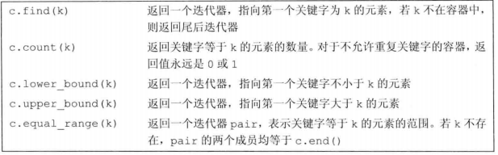
>> + 如果没有元素与关键字匹配，lower_bound和upper_bound会返回**相同**的迭代器，都指向给定关键字的插入点。

11.4 无序关联容器
> 无序容器在存储上组织为一组桶，每个桶保存零个或多个元素。容器使用一个hash表将元素映射到桶。无序容器的性能依赖于hash函数的质量桶的数量和大小。
>> 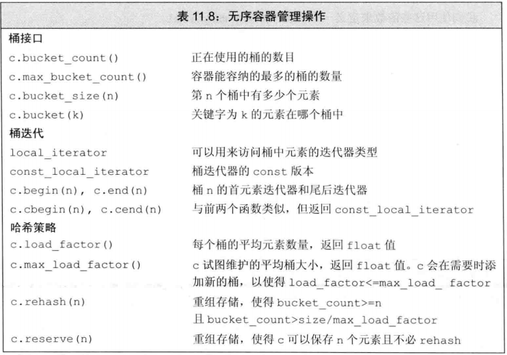
> + 不能够直接定义关键字类型为自定义类类型的无序容器，必须提供我们自己的hash模板版本，提供函数来替代==运算符和哈希值运算函数。

- - -

12.1.1 shared_ptr类
> 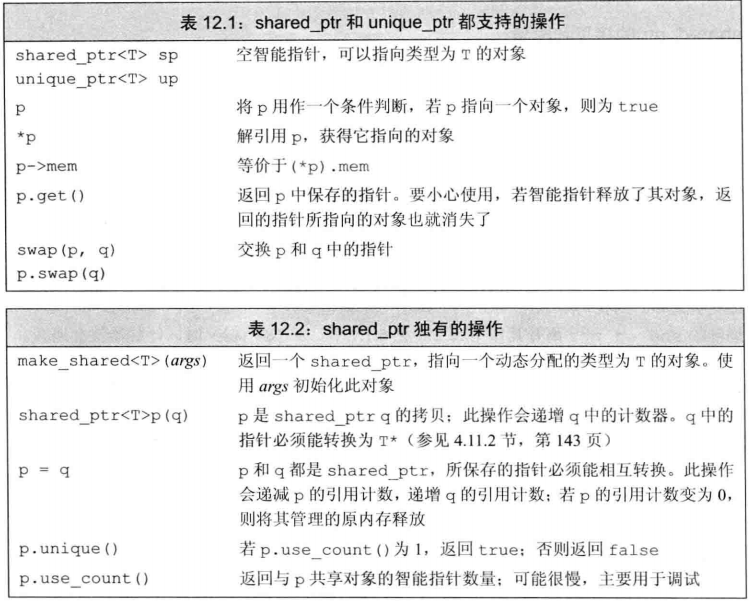
> + 引用计数：每个shared_ptr都会记录由多少个其他的shared_ptr指向相同的对象。一个shared_ptr的计数器变为0，就会自动释放自己所管理的对象。
> + 自动销毁：会自动调用对象的析构函数，会自动释放对象相关联的内存
> + 处于三种原因使用了动态生存期的类：不知道需要使用多少对象，不知道所需对象的准确类型，需要在多个对象中共享数据。

12.1.3 shared_ptr与new结合使用
> 1. 接受指针参数的智能指针构造函数是explicit，必须直接初始化
>> ```cpp
>> shared_ptr<int> p1 = new int(1024); //error
>> shared_ptr<int> p2(new int (1024)); //ok
>> //unique_ptr同样要显式初始化
>> ```
> 2. 智能指针&普通指针
>> + 使用一个内置指针来访问一个智能指针所负责的对象是很危险的，无法知道对象何时被销毁
>> + 不要使用get初始化另一个智能指针或者为智能指针赋值。
>>> <font color="red">注意！</font>使用get返回的内置指针的代码不能delete此指针，极有可能导致对同一片内存空间delete两次。

12.1.4 智能指针和哑类
> 1. 哑类是指要求用户显式释放资源的类，没有定义析构函数提供给智能指针。
>> + 定义智能指针时,传入自定义删除器可以释放资源
> 2. 智能指针规范
>> + 不使用相同的内置指针值初始化\(reset)多个智能指针
>> + 不delete get()返回的指针
>> + 不使用get()初始化或reset另一个指针
>> + 如果使用get()返回的指针，记住当最后一个对应的智能指针销毁后，指针就变成悬空指针
>> + 如果使用的智能指针管理的资源不是new分配的内存，记住传递给他一个删除器。

12.1.5 unique_ptr
> 1. 任何时刻只有一个unique_ptr指向一个给定对象。
> 2. unique_ptr不支持正常的拷贝和赋值（支持初始化，支持用将要销毁的unique_ptr的赋值或拷贝），可以通过reset()和release()方法转移unique_ptr的所有权
>> + reset()接受一个可选的指针参数，令unique_ptr重新指向给定的指针，自己原有的对象被释放
>> + release()切断unique_ptr与它管理的对象间的联系，返回指向对象的指针。

12.1.6 weak_ptr
> 1. weak_ptr绑定一个shared_ptr，不会改变其引用计数。

12.2.2 allocator类
> 1. 标准库allocator类及其算法
>> 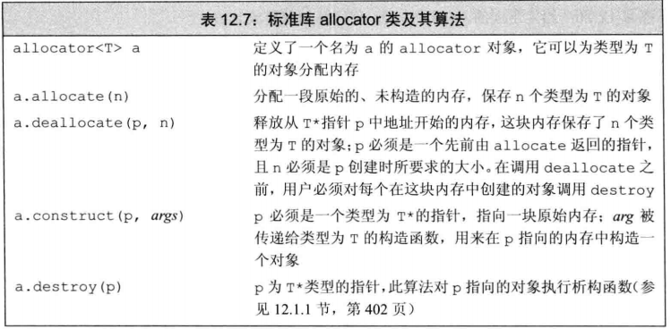
> 2. 相较于new/delete方法，解绑了内存分配/释放和对象构造/析构。例：可以先分配内存，需要时在进行对象创建
> 3. 拷贝和填充未初始化的算法
>> 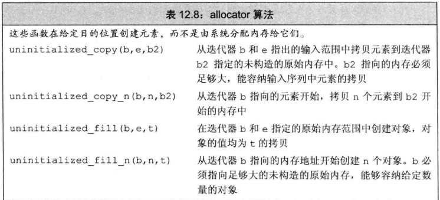

- - -